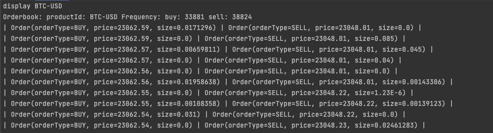

## Introduction

This application help you quick view Orderbook of Crypto product pairs.
The application connects to coinbase cloud and receive update of ongoing trade based on subscription model.

## Feature
1. Manage product pairs subscription 
2. Get realtime trade based view

## Build application

Application requires:
maven 3.5+ & jdk 17 on developers desktop.

Execute:  
```> mvn clean install```

## Run Application
From the target directory obtained after build find shade jar with name : Orderbook-1.0-SNAPSHOT-shaded.jar

Execute:
```> java -jar target/Orderbook-1.0-SNAPSHOT-shaded.jar```

After entering the application, run any of the following commands.
Try with any 4 commands - create, drop, list, display, exit.

1. create: Create new subscription for the product pair.
2. drop: Drop the created subscription.
3. list: List all created subscription.
4. display: Display the Orderbook of specified product pair.
5. exit: Exit the application.


## Orderbook View snapshot

